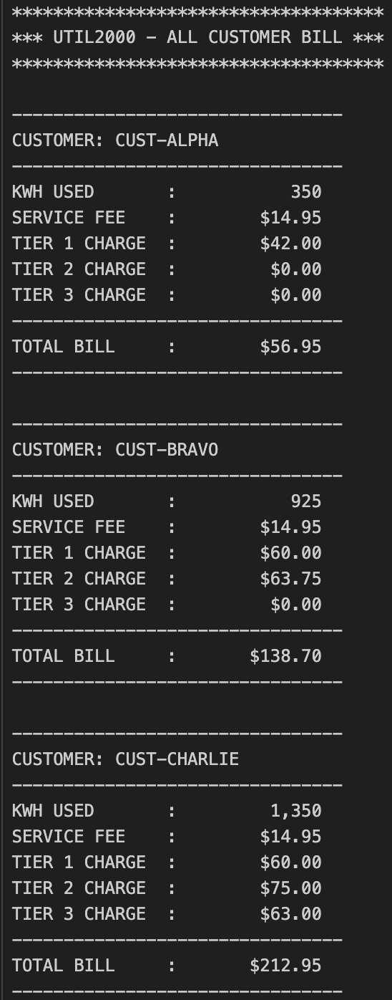

# COBOL UTIL2000
___

## Overview
___
This COBOl program is a utility billing system called UTIL2000 that calculates and prints monthly bills for multiple customers based on their kilowatt-hours (kWh) used.

## Table of Contents
___
* [New Concepts](#new-concepts)
* [Tech Stack](#tech-stack)
* [Installation](#installation)
* [Running Output](#running-output)
* [Learning Outcomes](#learning-outcomes)
* [Help](#help)
* [Authors](#authors)

## New Concepts
___
* Processing multiple customer records in a single program
* Using loops to handle repeated calculations (batch-style processing)
* Conditional logic for billing rates based on kWh usage
* Accumulating totals for reporting (e.g., total usage or total charges)
* Formatting structured output for readable billing statements
* Working with input/output files or simulated data sets

## Tech Stack
___
* 
* 
* 

## Installation
___
1. Clone the repository to your local machine. (or just steal my code)
2. Put the code into VS Code in your mainframe of choice

## Running Output
___

## Learning Outcomes
___
* Understand how COBOL handles real-world business applications like utility billing
* Apply conditional logic to calculate tiered or usage-based charges
* Develop skills in processing multiple records efficiently
* Practice organizing program logic for readability and maintainability
* Gain experience with formatted output for reports and customer statements
* Strengthen problem-solving skills using procedural programming techniques

## Help
___
* Make sure compiler is running correctly.
* Potentially re-clone repository
* restart IDE

## Author
___

**Clay Rasmussen**
* **Clay's GitHub Profile**: [Clay-Rasmussen](https://github.com/Clay-Rasmussen)
___
* **Clay's Email**: [Clrasm02@wsc.edu](mailto:clrasm02@wsc.edu)

[Back to the top](#overview)
